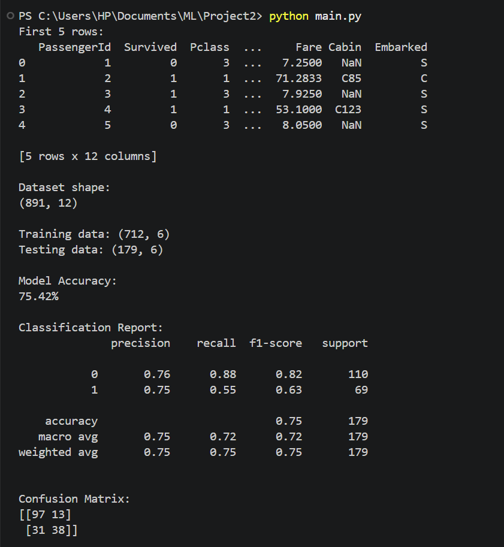

# 🚢 Titanic Survival Prediction Using Decision Tree Classifier

## 📌 Project Overview

This project predicts whether a passenger would **survive or not survive the Titanic disaster** using a **Decision Tree Classifier**.

The project demonstrates the complete machine learning workflow, including data loading, data preprocessing, feature selection, model training, prediction, and model evaluation.

---

## 🎯 Objectives

* Analyze the Titanic passenger dataset.
* Preprocess and clean the data.
* Select relevant features for prediction.
* Train a Decision Tree Classification model.
* Predict passenger survival.
* Evaluate the model using accuracy, classification report, and confusion matrix.
* Visualize the trained Decision Tree.

---

## 📊 Dataset

The project uses the **Titanic Dataset**, which contains information about passengers aboard the Titanic.

### Important Features Used

| Feature    | Description                       |
| ---------- | --------------------------------- |
| `Pclass`   | Passenger class                   |
| `Gender`   | Passenger gender                  |
| `Age`      | Passenger age                     |
| `SibSp`    | Number of siblings/spouses aboard |
| `Parch`    | Number of parents/children aboard |
| `Fare`     | Passenger ticket fare             |
| `Survived` | Target variable                   |

### Target Variable

* `0` → Did not survive
* `1` → Survived

---

## 🛠️ Technologies Used

* **Python**
* **Pandas** – Data loading and preprocessing
* **NumPy** – Numerical operations
* **Scikit-learn** – Machine learning model and evaluation
* **Matplotlib** – Data visualization
* **Seaborn** – Visualization support
* **VS Code** – Development environment

---

## 🤖 Machine Learning Model

### Decision Tree Classifier

A **Decision Tree Classifier** is a supervised machine learning algorithm that makes predictions by splitting the dataset based on feature conditions.

For this project, the model uses:

```text
DecisionTreeClassifier(
    criterion="gini",
    max_depth=5,
    random_state=42
)
```

The tree learns patterns from the training data and uses them to predict whether passengers in the test data survived.

---

## 🔄 Machine Learning Workflow

```text
Titanic Dataset
       ↓
Data Loading
       ↓
Feature Selection
       ↓
Data Preprocessing
       ↓
Handle Missing Values
       ↓
Convert Categorical Data
       ↓
Train-Test Split
       ↓
Decision Tree Training
       ↓
Prediction
       ↓
Model Evaluation
       ↓
Decision Tree Visualization
```

---

## 🧹 Data Preprocessing

The following preprocessing steps were performed:

1. Selected relevant features from the dataset.
2. Converted the `Gender` column into numerical values:

   * Male → `0`
   * Female → `1`
3. Filled missing `Age` values using the median age.
4. Filled missing `Fare` values using the median fare.
5. Removed remaining missing values.
6. Divided the dataset into training and testing sets.

The dataset was split using an **80:20 ratio**.

---

## 📈 Model Evaluation

The model was evaluated using:

### Accuracy

Accuracy measures the percentage of correctly classified passengers.

### Classification Report

The classification report provides:

* Precision
* Recall
* F1-score
* Support

### Confusion Matrix

The confusion matrix shows the number of:

* True Positives
* True Negatives
* False Positives
* False Negatives

---

## 🌳 Decision Tree Visualization

The trained Decision Tree was visualized using Scikit-learn's `plot_tree()` function.

The visualization shows how the model makes decisions based on passenger characteristics such as class, gender, age, fare, and family information.

### Result

The generated decision tree can be viewed in the project screenshots uploaded to this repository.

---

## 📸 Results

### Model Output

The project generates:

* Model accuracy
* Classification report
* Confusion matrix
* Decision Tree visualization

The screenshots below show the output obtained after running the model.

```markdown

```

---

## ▶️ How to Run the Project

### 1. Clone the Repository

```bash
git clone https://github.com/rishti018/Titanic-Survival-Prediction.git
```

### 2. Open the Project

Open the project folder in **VS Code**.

### 3. Install Required Libraries

Open the VS Code terminal and run:

```bash
pip install pandas numpy scikit-learn matplotlib seaborn
```

### 4. Run the Python Program

```bash
python titanic_decision_tree.py
```

The program will display the model evaluation results and the Decision Tree visualization.

---

## 📁 Project Structure

```text
Titanic-Survival-Prediction/
│
├── Titanic-Dataset.csv
├── titanic_decision_tree.py
├── README.md
│
└── screenshots/
    └── output.png
```

---

## 💡 Key Learning Outcomes

* Understanding the basics of supervised machine learning.
* Learning how to preprocess real-world datasets.
* Handling missing data.
* Converting categorical variables into numerical values.
* Understanding Decision Tree Classification.
* Splitting data into training and testing sets.
* Evaluating machine learning models.
* Visualizing a Decision Tree.
* Using Python libraries such as Pandas and Scikit-learn.

---

## 🚀 Future Improvements

The project can be improved by:

* Comparing Decision Tree with Random Forest and Logistic Regression.
* Performing hyperparameter tuning.
* Using cross-validation.
* Adding more data visualizations.
* Performing feature importance analysis.
* Building an interactive prediction interface.

---

## 👩‍💻 Author

Rishti

This project was developed as part of a Machine Learning project to demonstrate the implementation of a Decision Tree Classification algorithm on a real-world dataset.
